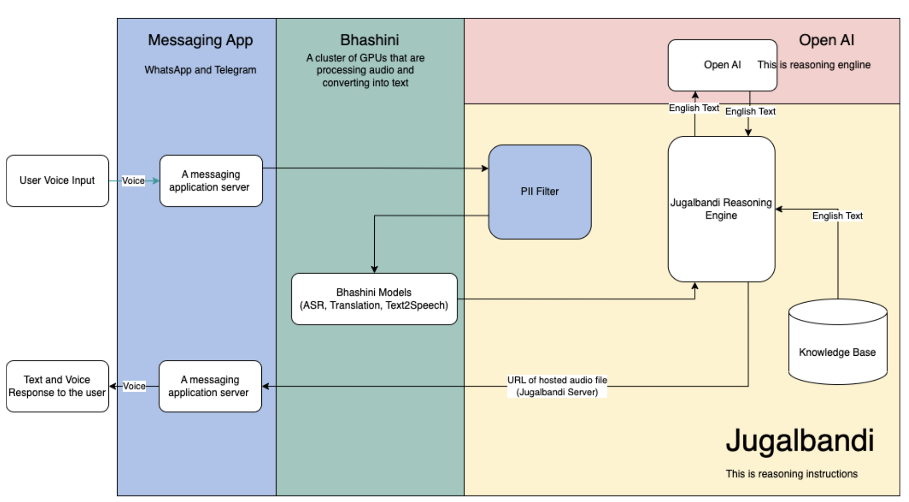
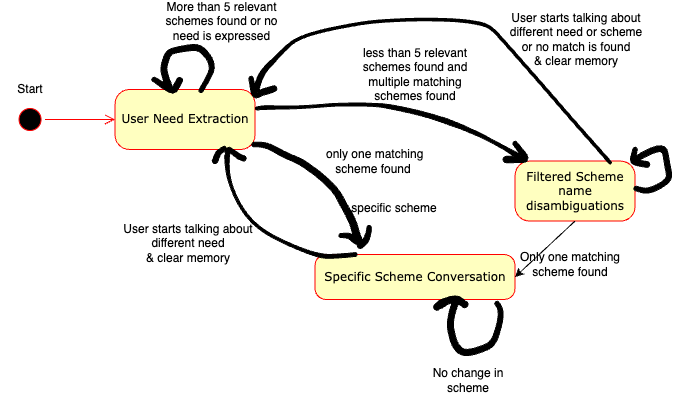

# Jugalbandi Chatbot
This repo is for jugalbandi chatbot API that works on [Indian government central schemes data](https://www.myscheme.gov.in/). The chatbot can provide information about which scheme is most relevant for the user, benefits of the scheme, eligibility criteria, documents required. [This video](https://www.youtube.com/watch?v=7sI6KJyYSrk) shows how to use this bot on whatsapp. You can chat with this bot using this [link](https://api.whatsapp.com/send/?phone=919667164605&text=hi).

## 1. Motivation
Illiteracy and lack of Information about government welfare schemes is the main in barrier in bottom of pyramid for getting those scheme benefits. However many of them have access to social media like Whatsapp on their mobile and can easily converse in local languages. Taking the welfare scheme information data like benefits, eligibility criteria and allowing citizens to converse with that data using voice.

## 2. Run bot API
Our bot API is build over FastAPI and uses Postgresql as the database. Before you can start running the API you need to 
set up some basic requirements given below: 
#### Step 1: Setting up your database 
* You have to create a postgresql database and then update its credentials in `.env` file.
#### Step 2: Setting up your cloud storage 
When using voice/audio conversation you need a place to store all the recordings and have a public url for them so that popular messaging application or your own app can work. 
* Fo this we have done the implementation for GCP, you can create a service account credential json file, and update ist path in `.env` file.

*Note: To use other cloud platform you can do an implementation for them in [cloud_filestorage.py](cloud_filestorage.py)*
#### Step 3: Installing requirements
```shell
pip install requirements.txt
```
#### Step 4: Starting the API
```shell
uvicorn main:app --host 0.0.0.0 --port 8080  --workers 1
```

This will start the API on 8080 port on which you can open the docs of API as `http://localhost:8080/docs` 

Alternatively, we have provided docker file which you can use to make a docker image after making appropriate changes and deploy over a service.

## 3. How the bot works?
Jugalbandi chatbot is a Finite State Machine which uses OpenAI models for doing transitions between the states and generating user responses.
Multiple AI components are put together to achieve this bot. 
### Data 
We scraped the Indian government welfare schemes data from https://www.myscheme.gov.in/. 

### Jugalbandi Building Blocks
#### 2.1 Messaging App
The bot can be deployed on popular messaging platforms of your choice like whatsapp or telegram. Ability to send voice notes and receiving the responses as voice notes is the key feature of this bot.
#### 2.2 Bhashini
[Bhashini](https://bhashini.gov.in/en) models are used to perform speech to text, Indic translations and text to speech. We leveraged the model APIs hosted by [AI4Bharat](https://models.ai4bharat.org/). 
#### 2.3 OpenAI
Embeddings models of OpenAI were used for doing the scheme searches. 
Davinci3 models of OpenAI were used to perform most of the reasoning and generate user responses.
#### 2.4 Jugalbandi Reasoning Engine
Jugalbandi Reasoning Engine is a finite state machine which uses openAI model responses to perform state transitions.

In User Need Extraction state, the goal of the chatbot is to capture the user need so as to find most relevant government schemes for the user. Filtered scheme name disambiguation state is where bot needs clarification from user about which scheme user is interested in. In Specific scheme conversation state, user discusses about a specific welfare scheme.
After each of the user inputs, openAI LLM is called to decide what should be the user response and next state.


## Acknowledgments
This work is part of [OpenNyAI](https://opennyai.org/) mission which is funded by [EkStep](https://ekstep.org/)
and [Agami](https://agami.in/). 
